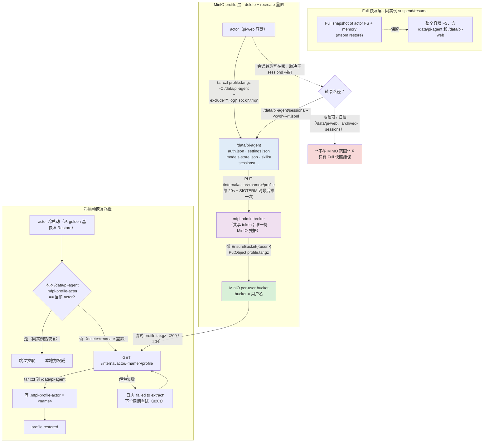

# 验证：mf-pi 用户数据是否真正存入 MinIO、且 actor 重置后能自动恢复

> 本文档是 mf-pi per-user MinIO profile 功能的**验证计划**（如何确认「用户数据存进了
> MinIO」、以及「delete+recreate 重置后能自动恢复」），同时记录至今的**观测结果**。
> 它回答两个问题：**① 用户的数据（auth / settings / models-store / skills /
> sessions）是否真的在 `profile.tar.gz` 里被推到了该用户的 MinIO bucket？② 用户 actor
> 被删除重建后，这些数据是否真的被拉回并生效？**
> 背景：实现文档见 `perUserMinioProfile.md`（含 supervisor 行为与恢复语义）；本文件专注
> 于**怎么查**与**查到了什么**。
>
> 当前阶段（2026-09-06）：**只诊断 + 报告，不改代码**。如发现真实的数据丢失缺口
> （例如会话转录落在 tar 范围之外），先记录根因并给出修复建议，代码改动另起任务。

## Guardrails（已确认）

- **只诊断 + 报告**。发现数据丢失缺口时不改代码（模板/supervisor/admin），只给结论 +
  mermaid 图 + 修复建议。
- **tom 只读**。可以经 router 查询 tom 的在线状态（providers source、sessions 列表）；
  **绝不** suspend / delete / recreate / resume tom，也不改他的数据。
- **任何会变更集群状态的测试**只用一次性用户（如 `e2e-check`），测完清理。
- 不产生 commit；不改 manifest / supervisor / admin。

---

## 1. 背景：数据分几层、分别覆盖什么

mf-pi 一个用户 == 一个运行 pi-web 的 Actor。用户数据靠**两层**保护：

| 层 | 触发 | 覆盖 | 内容 |
|---|---|---|---|
| **Full 快照**（快照层） | 同一实例 suspend / resume | 整个容器 FS + 进程内存 | `/data/pi-agent` **和** `/data/pi-web` 全都有 |
| **MinIO profile**（profile 层） | delete + recreate 重置（冷启动） | 仅 `/data/pi-agent`（经 mfpi-admin broker） | `auth.json` / `settings.json` / `models-store.json` / `skills/` / `sessions/` |

profile 层是**本验证的重点**：实例被重置后（旧实例的 Full 快照还在，但新实例不会去用它；
新实例从模板 golden 基快照 Restore），只有 MinIO 里的 profile 能带回用户数据。

### 1.1 数据流（概览 + 待验证的分支）



**待验证的关键分支**（空心箭头 → `WHERE`）：活跃会话转录 `.jsonl` **默认**落在
`/data/pi-agent/sessions/--<cwd>--/`（即在 profile tar 范围内）；但若 pi-web 被配置了
session-dir 覆盖、或转录被归档到 `$PI_WEB_DATA_DIR`（`/data/pi-web`），就会**掉出**
MinIO 范围。这正是「MinIO 里 `sessions/` 是空的」的候选根因。

### 1.2 `profile.tar.gz` 内容范围

| 在 tar 内（`/data/pi-agent` 下） | 不在 tar 内 |
|---|---|
| `auth.json`（DeepSeek key 等凭据） | `/data/pi-web/**`（pi-web 运行时状态、归档会话、sessiond socket） |
| `settings.json` | `*.log`、`*.sock`、`*.tmp`（tar 显式排除） |
| `models-store.json` | archived-sessions（`/data/pi-web/archived-sessions*`） |
| `skills/`（启动时 bootstrap 烤入） | |
| `sessions/…` 下的转录 **（若落在 agent dir 内）** | |

---

## 2. Step 1 — 直接检查 MinIO：每个用户存了什么

现成工具：`./check-minio-users.sh [--test] [--keys] [user ...]`

- 在 `mfpi-minio` Pod 内跑 `mc`（免 port-forward / 外部客户端），对每个 bucket 拉
  `profile.tar.gz` 并报告：
  - `.mfpi-profile-actor` tag（最近同步的 actor）
  - 存储的 DeepSeek key（默认掩码；`--keys` 显示完整值）
  - `skills/` 文件数、`sessions/` 文件数、`settings.json` / `models-store.json` 是否存在
  - 无 live actor 的保留 bucket（删除后保留，或 golden 启动 bucket）；无 bucket 的 live actor
- `--test` 指向 `ate-demo-mf-pi-test` / `mfpi-test`。

```bash
cd demos/mf-pi
./check-minio-users.sh            # prod（默认 ns ate-demo-mf-pi, atespace mfpi）
./check-minio-users.sh --keys tom # 只看 tom，显示完整 key
./check-minio-users.sh --test     # test 环境
```

> `sessions 0 files` 的意义：不是「工具坏了」，而是 **tar 里 `./sessions/` 确实只有空
> 目录**（无 `--<cwd>--/` 子目录、无 `.jsonl`）。要回答「是没产生过转录，还是转录写到了
> 别处」，需要 Step 2 的在线诊断。

---

## 3. Step 2 —（只读）在线诊断某个 live actor：转录到底写在哪 / 数据有没有恢复

以 tom（RUNNING，v21）为例。前提：tom 只读。

### 3.1 查 tom 的 auth 是否真的恢复了（providers source）

经 `atenet-router` 端口转发，带 `Host: <user>.<atespace>.actors.resources.substrate.ate.dev`：

```bash
P=$(python3 - <<'EOF'
import socket
s=socket.socket(); s.bind(("127.0.0.1",0)); print(s.getsockname()[1]); s.close()
EOF
)
kubectl port-forward -n ate-system svc/atenet-router "${P}:80" >/tmp/pf.log 2>&1 & PFPID=$!
trap 'kill $PFPID 2>/dev/null' EXIT
# 等 web ready（重复探测直到 200）
for i in $(seq 1 40); do
  curl -sf -m 8 -H "Host: tom.mfpi.actors.resources.substrate.ate.dev" \
    "http://127.0.0.1:${P}/api/machines/local/auth/providers?mode=login&authType=api_key" >/tmp/prov.json && break
  sleep 0.5
done
python3 -c 'import json;d=json.load(open("/tmp/prov.json"));
for p in d["providers"]:
    if p["id"]=="deepseek": print("deepseek source =", p["status"].get("source"), "| configured =", p["status"].get("configured"))'
```

- `source == "stored"` → tom 的 `/data/pi-agent/auth.json` 现在就有他存的 key（恢复生效）。
- `source == "environment"` / `"fallback"` 且 configured=false → 没恢复到 key（admin 靠
  `DEEPSEEK_API_KEY` env 兜底）。

### 3.2 查 tom 的会话转录（sessions 列表，按 cwd）

pi-web 的 sessions 按**工作目录**组织；同一端口转发下对每个候选 cwd 探测：

```bash
for cwd in "/workspace" "/data" "/data/home" "/"; do
  enc=$(python3 -c "import urllib.parse,sys;print(urllib.parse.quote(sys.argv[1],safe=''))" "$cwd")
  echo "=== cwd=$cwd ==="
  curl -sS -m 15 -H "Host: tom.mfpi.actors.resources.substrate.ate.dev" \
    "http://127.0.0.1:${P}/api/machines/local/sessions?cwd=${enc}" | head -c 3000; echo
done
```

- 返回的 session 列表里若有条目 → tom **有**真实转录，路径即对应 cwd → 接着去核对它在
  不在 `profile.tar.gz`（3.3/3.4）。
- 全部为空 → tom 从没在 pi-web 里产生过持久化 Pi session（可能只用过 golden 基里的
  环境，或会话从未落盘）。

### 3.3 核对 MinIO 里 tom 的 profile tar 内部

```bash
ROOT_USER="$(kubectl get secret mfpi-minio-admin -n ate-demo-mf-pi -o jsonpath='{.data.root-user}' | base64 -d)"
ROOT_PASS="$(kubectl get secret mfpi-minio-admin -n ate-demo-mf-pi -o jsonpath='{.data.root-password}' | base64 -d)"
kubectl exec -n ate-demo-mf-pi deploy/mfpi-minio -- sh -c \
  'mc alias set m http://127.0.0.1:9000 "$1" "$2" >/dev/null 2>&1 && mc cat "m/tom/profile.tar.gz"' \
  _ "$ROOT_USER" "$ROOT_PASS" > /tmp/tom-profile.tgz
tar tzf /tmp/tom-profile.tgz | head -40                     # 顶层结构
tar tzf /tmp/tom-profile.tgz | grep -c '\.jsonl$'            # sessions 转录数
tar xzOf /tmp/tom-profile.tgz ./.mfpi-profile-actor          # 归属 tag
tar xzOf /tmp/tom-profile.tgz ./auth.json | head -c 300      # auth.json 内容（含 key？）
tar xzOf /tmp/tom-profile.tgz ./settings.json | head -c 300  # settings.json 内容
```

注意 tar 内条目是 `./` 前缀，读文件用 `./name`（`tar xzOf`/`tar tzf`），不是裸 `name`。

### 3.4 还原历史时间线（tom 每次冷启动的 pull/push 结果）

```bash
kubectl ate logs actor tom -a mfpi | grep -E '"message":"mf-pi:' | python3 -c 'import sys,json
for l in sys.stdin:
    d=json.loads(l); print(d.get("time","")[:19], d.get("message"))'
```

对照：冷启动时 `mf-pi: cold boot … pulling profile` → 之后是
`profile restored for 'tom'`（恢复成功）还是 `downloaded profile for 'tom' failed to
extract`（失败，下个周期重试），以及周期 push 是否成功。

---

## 4. Step 3 —（变更集群；可选）delete+recreate 端到端恢复验证

> 只在**一次性用户**上做。alice/chris/michael/tom 一律不碰。验证思路：先造出**每一种
> 类型**的独特数据 → 等 >1 个 push 周期 → 快照 MinIO → delete+recreate+resume → 看
> 冷启动后**不需要人工干预**就恢复了哪些。

```bash
cd demos/mf-pi
U=e2e-check; KEY=sk-e2echeck-$(date +%s)

# 1) 建用户 + 恢复（resume 让 supervisor 跑起来）
./create-user.sh "$U"; kubectl ate resume actor "$U" -a mfpi

# 2) 造数据：
#    a) auth：注入一个独特的 DeepSeek key（经 pi-web 流程写进 auth.json）
./set-user-apikey.sh "$U" "$KEY"
#    b) sessions：通过 pi-web UI / API 发起一次真实对话，让一个 .jsonl 转录落盘
#       （这是"会话是否进 MinIO"的关键——见 Step 2 定位转录实际路径后再跑）
#    c) settings/models：真实会话运行后一般会自动生成；skills 由 bootstrap 烤入

# 3) 等 >1 个 push 周期，快照 MinIO
sleep 30; ./check-minio-users.sh "$U" --keys
#    预期：tag=$U；deepseek key=$KEY；skills>0；settings.json/models-store.json 存在；
#    若会话转录在 agent dir 内：sessions > 0

# 4) 重置（delete 保留 bucket）→ 重建 → resume
./delete-user.sh "$U"; ./create-user.sh "$U"; kubectl ate resume actor "$U" -a mfpi

# 5) 监视冷启动恢复
kubectl ate logs actor "$U" -a mfpi -f | grep -E 'mf-pi:'

# 6) 验证恢复后状态（同上 3.1/3.2 的 router 查询，host 换成 $U.$ATESPACE…）
#    - deepseek source 回到 "stored"（未重新注入 → 证明 auth.json 是拉回来的）
#    - 若造过会话：sessions 列表里能看到第 2 步那个转录
./check-minio-users.sh "$U" --keys   # MinIO 里各类型仍在

# 7) 清理
./delete-user.sh "$U"
```

**判定**：
- `source: stored` 且无需重新注入 → auth 恢复 ✓
- settings/models/skills 回来 ✓
- **会话转录**在列表里重新出现 → 会话经 MinIO 往返 ✓（这是最需要盯的一项）

---

## 5. 至今的观测结果（快照，2026-09-06）

**prod（`ate-demo-mf-pi` / `mfpi`）**：alice/chris/michael SUSPENDED；tom RUNNING (v21)。

| bucket | live actor | tag | deepseek key | skills | sessions | settings/models | synced |
|---|---|---|---|---|---|---|---|
| `tom` | ✓ RUNNING | tom | 存了（`sk-804…218e`） | 1357 | **0** | ✓ | 11:49:25 |
| `alice` / `chris` / `michael` | ✓ (suspended) | 各自 | unset | 1357 | **0** | ✓ | 05:59–06:00 |
| `61189fe7-…`（golden UUID） | ✗ 无 live actor | = UUID | unset | 1357 | 0 | ✗ | 03:39:52 |

- 每个 bucket 都有 `profile.tar.gz`（19.1 MB）；**所有用户的 `sessions/` 都是 0 文件**
  （只有空目录）。
- golden-UUID bucket = 模板 golden 基 actor 的启动 bucket：无真实用户、无 auth、无
  settings/models —— 重置恢复的目标就是「新 actor 别用这份，去拉自己的那份」。
- **tom 的 auth 已确认恢复**：live providers `deepseek.source == "stored"`（经 router
  探测）。tom 上次冷启动日志是 `failed to extract`（06:02:00），但 bucket 之后被同步
  （现在 11:49:25）且 auth 生效 —— 说明那次解包失败被后续周期/状态兜住，或 key 由
  Full 快照状态携带；**auth 层面没有丢失**。
- **test（`mfpi-test`）**：`e2e` / `iso` bucket 保留（E2E 遗留），当前无 live actor。

**尚未定论**：sessions 为什么是 0 —— 是「pi-web 里从没落过盘的真实会话」、还是「转录
写在了 `/data/pi-agent` 之外（如 `/data/pi-web`），所以 tar 抓不到」。这是 Step 2 / Step
3 要给出答案的问题。

---

## 6. 发现记录模板（跑完 Step 2/3 后填）

- [ ] 转录实际路径：`/data/pi-agent/sessions/…` 内，还是 `…/` 外（给出证据：sessions
      列表 / FS 快照 / tar 内容）
- [ ] 它是否在 `profile.tar.gz` 范围内？（在 → 会随 push 进 MinIO；不在 → 重置即丢）
- [ ] 真实的一次会话能否经 MinIO 往返？（Step 3 的 sessions 复现）
- [ ] tom / 被测用户真实状态：auth、settings、models、skills、sessions 各恢复与否
- [ ] 若确认数据丢失缺口，记录根因与推荐修法：
      - **A**：把 tar 范围扩到转录真实所在目录（如一并同步 `/data/pi-web/sessions` /
        `archived-sessions`），并设计对应恢复/合并策略；
      - **B**：在 ActorTemplate env 设 `PI_CODING_AGENT_SESSION_DIR=/data/pi-agent/sessions`
        （扁平、落在已同步目录内），让 pi-web 把活跃转录写进现有 profile 范围；
      - 两者都要评估对恢复逻辑（`tag_profile` / `profile_matches`，见
        `perUserMinioProfile.md`）的影响。

---

## 参考

- 实现/设计文档（supervisor 行为、恢复语义、E2E 配方）：
  `perUserMinioProfile.md`、`README.md`
- supervisor（push/pull、tag、冷启动逻辑）：`mf-pi.yaml.tmpl`（prod）、
  `mf-pi-test.yaml.tmpl`（test）
- MinIO broker（token 门控 GET/PUT、懒 EnsureBucket）：`admin/profile.go`、`admin/main.go`
- MinIO 检查工具：`check-minio-users.sh`
- 用户/API 脚本：`create-user.sh` / `delete-user.sh` / `set-user-apikey.sh`（+`-test`）
- pi-web 会话路径解析（转录为何可能不在 agent dir）：pi-web 仓库
  `src/server/sessions/piSessionManagerGateway.ts`、`src/config.ts`、
  `src/server/sessions/sessionArchiveStore.ts`
